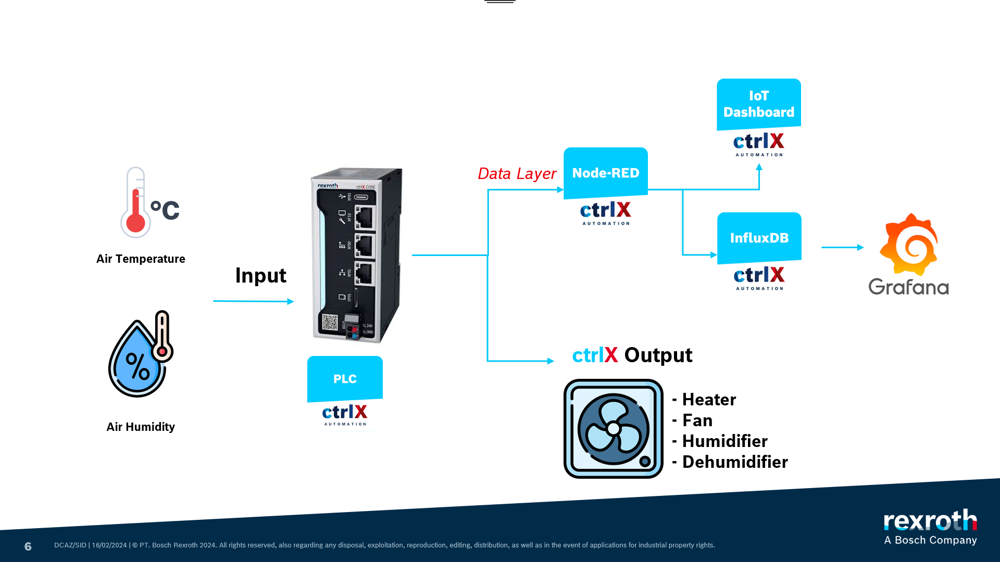
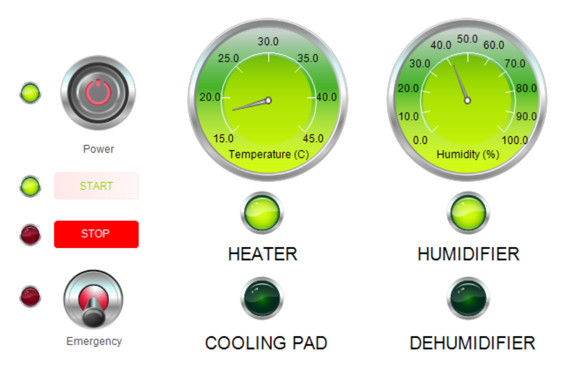
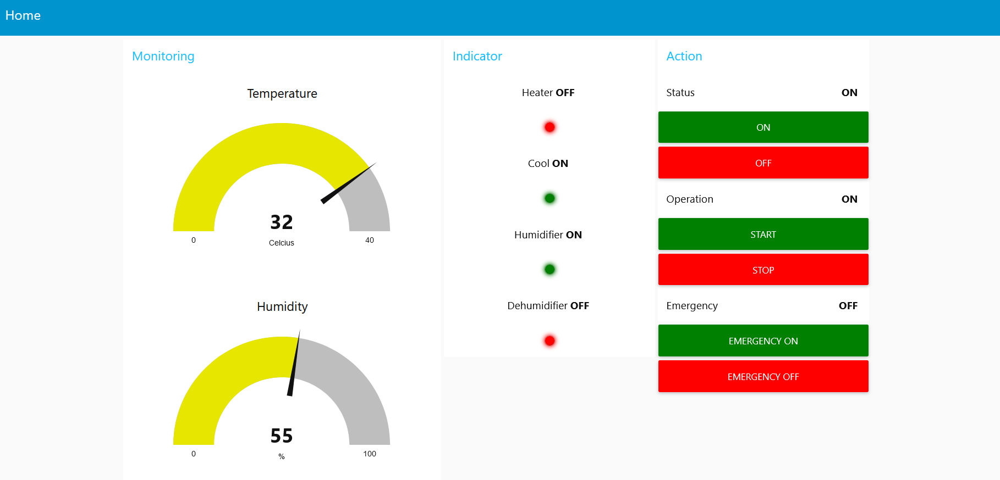

# Green House Monitoring
## System Topology

  

## PLC Visualization
The temperature and humidity variable generated with random value (virtual project)

  

## NodeRED Dashboard

  

## Issues
- Program loaded - EXCEPTION
  This issue caused by the visualization compiler. Change the compiler to VISU_NO_EXCEPTION_HANDLING. Go to the forum for detailed information [here](https://forge.codesys.com/forge/talk/Engineering/thread/3c14d0f00d/).

